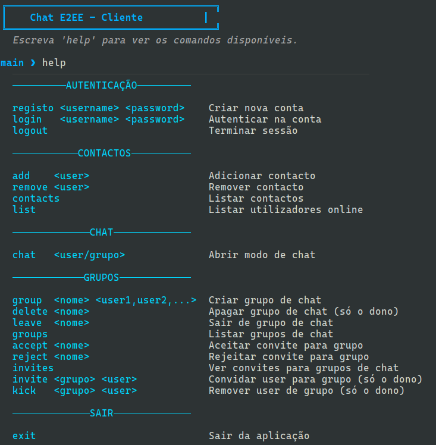

# SSI (Segurança de Sistemas Informáticos) (Português)
Projeto de grupo desenvolvido no âmbito da unidade curricular de SSI. O projeto consiste no desenvolvimento de um sistema de conversação (_chat_) com _End-to-End Encryption_ (_E2EE_).

O sistema permite que os utilizadores troquem mensagens com garantias estritas de condencialidade, integridade e autenticidade, assegurando que o conteúdo das comunicações permanece inacessível a terceiros, incluindo o servidor que intermedeia o serviço. A implementação é feita em _Python_, utilizando obrigatoriamente a biblioteca  `cryptography`  para a implementação de primitivas criptográcas.

Pode consultar o [enunciado](./assets/enunciado-ssi.pdf) e o [relatório](./assets/relatorio-ssi.pdf) do projeto.

---

<p align="center">
    
</p>

---

## Membros do grupo
- [darteescar](https://github.com/darteescar)
- [luis7788](https://github.com/luis7788)
- [tiagofigueiredo7](https://github.com/tiagofigueiredo7)

>[!Warning]
>**Dependências:** Para correr o projeto é necessário ter instaladas as bibliotecas `cryptography` e `prompt_toolkit`. Para isso basta correr o seguinte comando:
>```bash
>pip install cryptography prompt_toolkit
>```

## Setup
Depois de fazer clone do repositório, é necessário criar um ambiente virtual de _Python_ e instalar as dependências.

```bash
python -m venv .venv
source .venv/bin/activate
pip install cryptography prompt_toolkit
```

## Run
Para correr o projeto é necessário correr primeiro o servidor:

```bash
python server/server.py
```
Depois, para cada cliente, basta correr o seguinte comando:

```bash
python client/client.py
```

>[!Tip]
>A partir daqui, para cada cliente, pode utilizar os comandos que se encontram na imagem acima, ou escrever `help` para obter a lista de comandos disponíveis. 

# SSI (Computer Systems Security) (English)
Group project developed within the scope of the SSI course. The project consists of developing a chat system with End-to-End Encryption (E2EE).

The system allows users to exchange messages with strict guarantees of confidentiality, integrity, and authenticity, ensuring that the communication content remains inaccessible to third parties, including the server that mediates the service. The implementation is done in Python, necessarily using the `cryptography` library for the implementation of cryptographic primitives.

You can consult the [project assignment](./assets/enunciado-ssi.pdf) and the [project report](./assets/relatorio-ssi.pdf).

---

<p align="center">
    
</p>

---

## Group members
- [darteescar](https://github.com/darteescar)
- [luis7788](https://github.com/luis7788)
- [tiagofigueiredo7](https://github.com/tiagofigueiredo7)

>[!Warning]
>**Dependencies:** To run the project it is necessary to have the `cryptography` and `prompt_toolkit` libraries installed. For that, simply run the following command:
>```bash
>pip install cryptography prompt_toolkit
>```

## Setup
After cloning the repository, it is necessary to create a Python virtual environment and install the dependencies.

```bash
python -m venv .venv
source .venv/bin/activate
pip install cryptography prompt_toolkit
```

## Run
To run the project, it is necessary to run the server first:

```bash
python server/server.py
```
Then, for each client, simply run the following command:

```bash
python client/client.py
```

>[!Tip]
>From here, for each client, you can use the commands that are in the image above, or write `help` to obtain the list of available commands.

