# Sistema de Conversação Seguro
## Relatório do Trabalho Prático
## Sistemas de Segurança Informática - 2025/2026

## Autores
- A106936 - Duarte Escairo Brandão Reis Silva
- A106932 - Luís António Peixoto Soares
- A106856 - Tiago Silva Figueiredo

# Introdução
No âmbito da unidade curricular de Segurança de Sistemas Informáticos foi proposto um trabalho prático que visava desenvolver um serviço de _chat_ que garantisse a segurança das comunicações através de _End-to-End Encryption_ (E2EE).

Assim sendo, o nosso grupo de trabalho desenvolveu o projeto de acordo com os requisitos apresentados no enunciado, tendo em conta as primitivas de segurança estudadas e as propriedades que se pretendiam garantir, como confidencialidade, integridade e autenticação das mensagens trocadas durante a comunicação.

# Arquitetura
Nesta secção do relatório serão abordadas as estratégias usadas na implementação do nosso programa, desde a forma como o cliente envia e recebe as suas mensagens, bem como a forma que elas são verificadas e executadas pelo servidor, mas sem menção das primitivas e mecanismos de segurança implementados.

## Descrição Geral
A implementação do cliente e do servidor recorreu a diferentes soluções de software para garantir que fosse um sistema completo e funcional, com as capacidades mínimas esperadas de um programa deste tipo. As mais relevantes que merecem ser mencionadas são:

- o uso de sockets TCP para a comunicação entre o cliente e o servidor
- uma arquitetura _Thread-per-Connection_ do servidor, com duas _threads_ por cliente: uma que lê do socket e outra que executa e escreve as respostas nele.
- uso de uma base de dados JSON para os vários dados necessários guardar (uutilizadores, mensagens, grupos, etc...).
- uso de mecanismos de gestão de concorrência para garantir o acesso controlado e correto dos vários recursos do servidor.
- uso da biblioteca _cryptography_ do _python_ para a utilização das várias primitivas de segurança necessárias
- uso da biblioteca _prompt_toolkit_ do _python_ para a criação de uma interface simples e responsiva no terminal

## Servidor
O programa do servidor desenvolvido neste projeto é, obviamente, responsável por ler as mensagens que lhe são enviadas, processá-las (consoante a lógica de negócio) e responder aos clientes. Para inicializá-lo, basta apenas executar o ficheiro respetivo:

```c
python3 server/server.py
```

E, a partir deste momento, os clientes poderão estabelecer ligação através do endereço 127.0.0.1 na porta 6767. Para cada ligação que chegue, o servidor irá delegar, tal como dito anteriormente, duas _threads_ que irão tratar da lógica de negócio para esse cliente.

Visto ser necessário garantir o controlo de acesso aos vários recursos entre as _threads_ que correrem no servidor, foram utilizados _locks_ no acesso aos métodos que alterassem o conteúdo dos vários ficheiros da base de dados.

Para a depuração e teste do servidor, enquanto este corre, são escritos no terminal um conjunto de _logs_ que ajudam a saber os clientes conectados, as mensagens que eles enviam, as mensagens que eles recebem e as mensagens trocadas (necessárias na camada criptográfica).

## Cliente
Tendo o servidor a correr, é depois possível executar o cliente fazendo:

```c
python3 client/client.py
```

Com isto, o cliente terá uma ligação estabelecida com o servidor através do socket criado e poderá, a partir daqui, enviar todo o tipo de mensagens que pretender usando a interface gráfica. Em resumo, os comandos disponíveis são:


Também é de notar que o modo de chat exige uma chamada diferente para os comandos (visto o conteudo dele ser interpretado como texto), e assim, a chamada dos comandos é feita usando '/' como prefixo:


# Modelo de Segurança
Visto que o intuito deste projeto era a implementação de um sistema de comunicação seguro, foi nesta parte que o grupo de trabalho se focou. Como o funcionamento desta parte do sistema é composta por várias fases, o grupo decidiu explicá-las separadamente.

## Handshake
Tal como lecionado, para garantir uma comunicação segura entre dois pontos, é necessário estabelecer um segredo partilhado entre eles, que é a base para a criação de chaves e posterior uso em cifras modernas que cifrarão as mensagens trocadas.

Por esta razão, a fase de _handshake_ entre o cliente e o servidor é estabelecida através de uma versão mais fraca do protocolo 'Station-to-station', em que é estabelecida uma chave assimétrica usando o método Diffie–Hellman. Como este método é suscetível de ataques _Man-in-the-Middle (MitM)_, foi necessário pressupor que o cliente já tivesse o certificado do servidor na sua máquina (já que num caso de uso real seria obtido através de uma entidade de certificação autorizada) e por isso mesmo este está guardado com o restante programa do cliente. De uma forma geral, esta fase segue o seguinte diagrama:

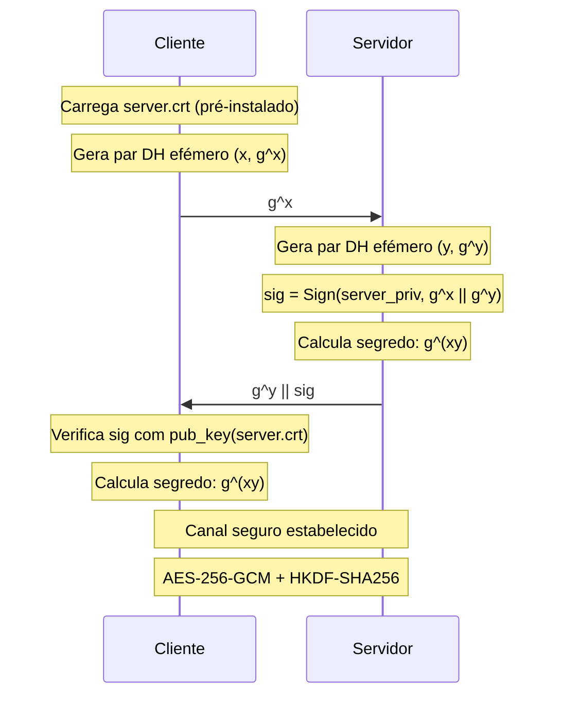

Esta troca de dados garante o estabelecimento de um canal seguro pelo simples facto do servidor ser o único detentor da sua chave privada RSA e o cliente conseguir verificar a assinatura proveniente do servidor (visto ter a chave pública presente no certificado dele). Desta forma, mesmo que um MiTM tentasse estabelecer um canal entre o cliente e o servidor, nunca seria capaz pois: 

- não conseguiria fingir ser o servidor pois teria de alterar o g^x enviado pelo cliente sem que este se apercebesse da alteração na assinatura que receberia na resposta.
- nunca conseguiria fingir ser o servidor pois não seria capaz de assinar os dados sem a chave privada do mesmo.
- e devido às propriedades matemáticas dos números trocados, nunca seria capaz de saber o segredo estabelecido.

Contudo, é de notar que existiam outras alternativas para atingir o mesmo objetivo, por exemplo, usando a chave pública do servidor e usando uma estratégia de _Hybrid Encryption_ para o estabelecimento do segredo inicial, no entanto, caso se usasse esta estratégia, o comprometimento da chave privada RSA do cliente comprometeria todas as comunicações efetuadas entre o cliente e o servidor, já que usando a mesma, bastaria decifrar a chave simétrica usada para cifrar as mensagens, quebrando toda a confidencialidade das comunicações passadas e não garantindo _Perfect Forward Secrecy_. 

Com o uso do DH, mesmo que um atacante conseguisse obter a chave privada do cliente, nunca conseguiria saber o segredo pois não saberia qual o número usado para elevar a potência, já que este nunca é persistido (vive apenas em memória). No entanto, é necessário notar que esta versão do protocolo apenas autentica o servidor durante o handshake, deixando o cliente anónimo nesta fase. Esta decisão foi deliberada: no caso do registo, o cliente ainda não possui qualquer identidade prévia que possa ser usada para o autenticar; no caso do login, autenticar o cliente durante o próprio handshake implicaria que o servidor tivesse de conhecer a sua identidade antes do canal estar estabelecido, complicando desnecessariamente o protocolo. Por estas razões, a autenticação do cliente é feita posteriormente, dentro do canal seguro já estabelecido, no momento em que este requisita o registo ou o login — mecanismo esse que será detalhado no capítulo seguinte.

## Atribuição de Certificados
Após o estabelecimento do canal seguro descrito no capítulo anterior, o cliente envia ao servidor o seu pedido de registo ou login. É neste momento, dentro do canal já cifrado, que a autenticação do cliente é efetivamente realizada e, no caso do registo, em que o certificado é emitido.
### Autenticação no Login
No caso do login, o cliente já possui um certificado emitido previamente pelo servidor, bem como o par de chaves RSA correspondente. Para se autenticar, envia ao servidor o seu username, a sua password, e uma assinatura digital sobre os valores efémeros do handshake realizado anteriormente, ou seja, Sign(priv_cli, g^x || g^y).

O servidor, ao receber este pedido, começa por verificar a password: aplica o algoritmo PBKDF2-HMAC-SHA256 com o salt previamente guardado e compara o resultado com o hash armazenado. Só após esta verificação passar é que procede à verificação da assinatura, extraindo a chave pública do certificado associado ao username recebido e confirmando que a assinatura é válida. Apenas quando ambas as verificações são bem-sucedidas é que o cliente está autenticado.

Esta abordagem de dupla verificação garante propriedades complementares:

- A verificação da password confirma que quem está do outro lado conhece o segredo partilhado com o utilizador legítimo, funcionando como um primeiro factor de autenticação.
- A verificação da assinatura RSA prova que o cliente possui efectivamente a chave privada correspondente ao certificado registado — propriedade conhecida como proof of possession —, pois apenas o detentor dessa chave privada conseguiria produzir uma assinatura que verifica com a chave pública correspondente. Mais subtilmente, prova que a assinatura foi produzida nesta sessão específica, e não numa qualquer sessão anterior, devido ao facto dos valores g^x e g^y serem únicos a este handshake.

Esta segunda propriedade é o que protege contra ataques de replay. Num cenário hipotético em que um atacante conseguisse obter uma assinatura antiga de um cliente legítimo, não poderia reutilizá-la para se autenticar numa sessão nova: os valores g^x e g^y seriam completamente diferentes, e a verificação da assinatura iria falhar. Funciona, na prática, como um mecanismo de challenge-response implícito, onde o "desafio" emerge naturalmente do próprio handshake, sem necessidade de uma ronda adicional de comunicação. Para melhor visualizar esta troca de dados, foi criado o diagrama respetivo:

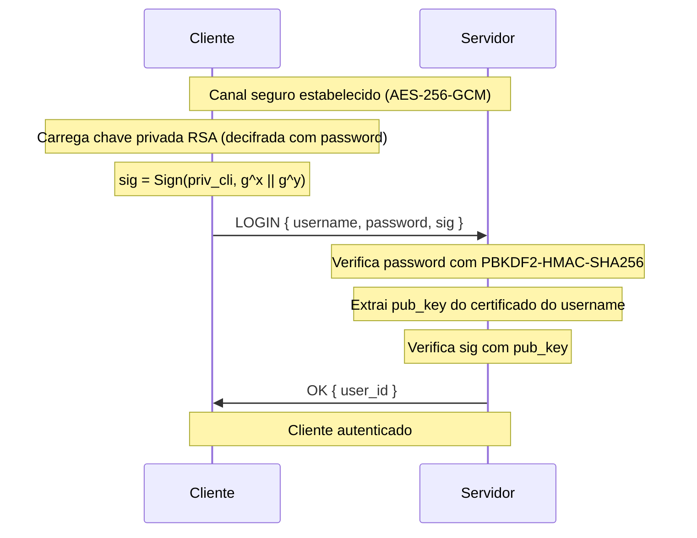

### Registo e Emissão de Certificado
No caso do registo, o cliente ainda não possui qualquer identidade prévia, pelo que o processo é necessariamente diferente. O cliente começa por gerar localmente um par de chaves RSA e envia ao servidor, dentro do canal seguro, o seu username pretendido, a sua chave pública recém-gerada, a password, e uma assinatura sobre a concatenação dos valores efémeros do handshake com a sua chave pública, Sign(priv_cli, g^x || g^y || pub_cli), produzida com a chave privada que acabou de gerar.

O servidor, ao receber este pedido, verifica primeiramente que o username ainda não está em uso. Em seguida, verifica a assinatura usando a chave pública que o próprio cliente acabou de enviar. Esta verificação é fundamental, pois garante que o cliente possui efectivamente a chave privada correspondente à chave pública que está a tentar registar. Sem esta verificação, qualquer entidade poderia registar uma chave pública que não controla — possivelmente pertencente a um terceiro — criando identidades fantasma ou possibilitando ataques de personificação. O facto da assinatura cobrir também a chave pública pub_cli impede adicionalmente que um atacante que intercete o pedido substitua a chave pública por uma sua, pois a assinatura deixaria de ser válida. Tal como no login, a cobertura dos valores g^x e g^y impede que uma assinatura obtida noutro contexto seja reutilizada para registar uma identidade em nome de outro utilizador.

Após estas verificações, o servidor procede ao armazenamento da password e à emissão do certificado. Para a password, gera um salt aleatório de 128 bits e aplica PBKDF2-HMAC-SHA256, armazenando apenas o hash resultante juntamente com o salt. Desta forma, mesmo em caso de comprometimento da base de dados, as passwords dos utilizadores permanecem protegidas.

De seguida, o servidor gera um certificado X.509 que associa o username à chave pública do cliente, assinando-o com a sua própria chave privada — atuando assim como entidade certificadora do sistema. O certificado é então enviado ao cliente, ainda dentro do canal seguro.

Do lado do cliente, o certificado é armazenado localmente. A chave privada RSA é cifrada antes de ser guardada: é derivada uma chave simétrica a partir da password do utilizador usando PBKDF2-HMAC-SHA256 com um salt aleatório, e a chave privada é cifrada com ChaCha20-Poly1305 usando essa chave derivada. Desta forma, apenas o legítimo dono, que conhece a password, consegue decifrar e usar a chave privada — mesmo que os ficheiros locais sejam comprometidos.

A partir deste momento, o utilizador está registado no sistema e possui todas as credenciais necessárias para se autenticar via login em sessões futuras, bem como para participar em comunicações cifradas com outros utilizadores, como será descrito nos capítulos seguintes. Tal como feito anteriormente, foi desenvolvido um diagrama para ajudar a visualizar esta troca de mensagens:
 

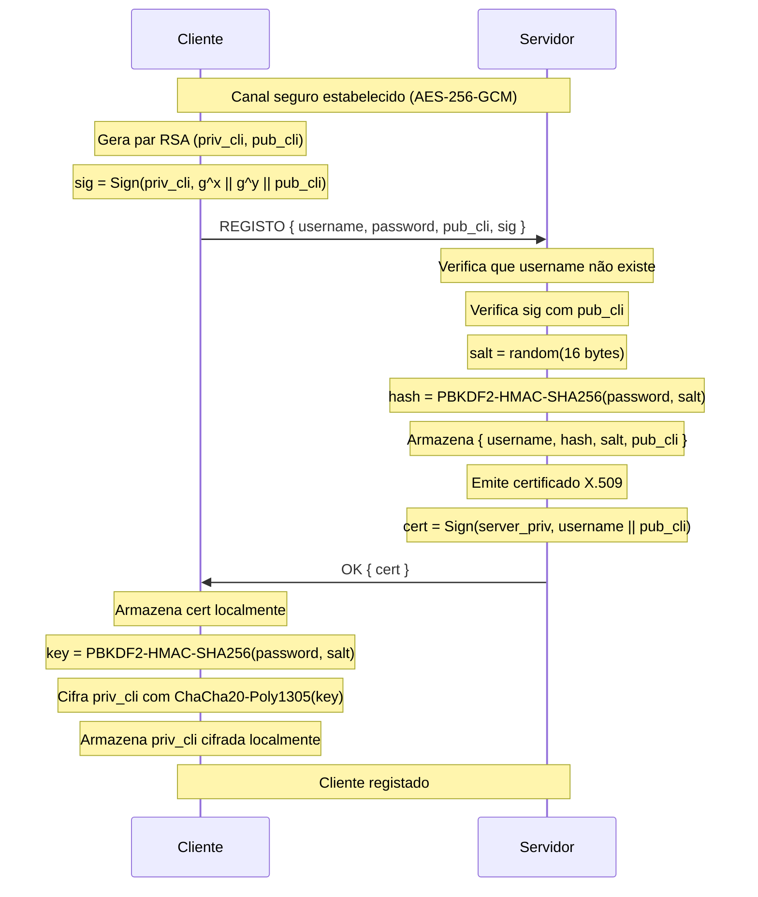
## Fluxo normal de mensagens

### Cálculo das chaves efémeras

Após o estabelecimento do canal seguro, todas as mensagens trocadas entre cliente e servidor são cifradas com AES-256-GCM. Como o segredo partilhado g^(xy) resultante do handshake DH é um elemento de grupo matemático e não bytes criptograficamente uniformes, é necessário transformá-lo em material de chave adequado antes de o usar diretamente. Para o efeito, utiliza-se a HKDF-SHA256, uma função que deriva chaves de sessão com alta entropia a partir dos seus _inputs_. Para cada mensagem é derivada uma chave distinta a partir do segredo partilhado, com um _info_ que inclui a direção e o número de sequência da mensagem:

- *Mensagens do cliente para o servidor:* K_c2s(n) = HKDF(g^(xy), "c2s-msg-n")

- *Mensagens do servidor para o cliente:* K_s2c(n) = HKDF(g^(xy), "s2c-msg-n")

onde *n* é um contador independente por direção, incrementado a cada mensagem enviada. 

Este contador é também utilizado como nonce do AES-GCM (com padding apropriado para os 12 bytes esperados pelo algoritmo), garantindo que o par (chave, nonce) é único em cada operação de cifra — propriedade crítica para a segurança do AES-GCM, cuja violação comprometeria irreversivelmente a confidencialidade e a integridade.

A separação em duas chaves direccionais evita que a mesma chave seja usada nos dois sentidos: se ambos os lados cifrassem com a mesma chave, seria necessário coordenar contadores entre cliente e servidor para garantir unicidade dos nonces, com risco de colisões em caso de envios simultâneos. Adicionalmente, esta separação protege contra ataques de reflexão, em que um atacante poderia tentar reencaminhar uma mensagem do servidor de volta ao próprio servidor fingindo ser proveniente do cliente.

A utilização de contextos distintos no _info_ do HKDF garante que cada chave K_n é criptograficamente independente das restantes — ou seja, comprometer uma chave individual K_n não fornece qualquer informação sobre as outras chaves derivadas do mesmo segredo, propriedade que assegura _forward secrecy_ ao nível da mensagem individual.

Quanto à prevenção de ataques de replay, esta é garantida pela verificação do contador em cada receção: mensagens com um contador igual ou inferior ao último processado nessa direcção são rejeitadas, impedindo a reinjecção de mensagens previamente capturadas. Para melhor visualizar, o seguinte diagrama descreve o fluxo de estabelecimento das chaves efémeras:

```mermaid
sequenceDiagram
    participant C as Cliente
    participant S as Servidor

    Note over C,S: Canal seguro estabelecido — g^(xy)

    Note over C: n_send = 0, n_recv = 0
    Note over S: n_send = 0, n_recv = 0

    rect rgb(40, 60, 80)
        Note over C,S: Mensagem 1 — Cliente → Servidor
        Note over C: n_send += 1  →  n_send = 1
        Note over C: K = HKDF(g^(xy), "c2s-msg-1")
        Note over C: nonce = 1
        Note over C: cifra = AES-256-GCM(K, nonce, msg)
        C->>S: nonce || cifra
        Note over S: nonce recebido == (n_recv+1) ✓
        Note over S: n_recv += 1  →  n_recv = 1
        Note over S: K = HKDF(g^(xy), "c2s-msg-1")
        Note over S: msg = AES-256-GCM-Decrypt(K, nonce, cifra)
    end

    rect rgb(40, 60, 80)
        Note over C,S: Mensagem 2 — Servidor → Cliente
        Note over S: n_send += 1  →  n_send = 1
        Note over S: K = HKDF(g^(xy), "s2c-msg-1")
        Note over S: nonce = 1
        Note over S: cifra = AES-256-GCM(K, nonce, resp)
        S->>C: nonce || cifra
        Note over C: nonce recebido == (n_recv+1) ✓
        Note over C: n_recv += 1  →  n_recv = 1
        Note over C: K = HKDF(g^(xy), "s2c-msg-1")
        Note over C: resp = AES-256-GCM-Decrypt(K, nonce, cifra)
    end
```

### Rotação de chaves
Apesar da _forward secrecy_ ao nível da mensagem individual, o segredo raiz g^(xy) permanece como ponto único de comprometimento: caso seja extraído da memória de um dos intervenientes, todas as chaves do intervalo atual podem ser derivadas. Para limitar a janela de exposição face a este cenário, é implementada uma rotação periódica do próprio segredo.

A rotação é iniciada pelo cliente após cada 10 mensagens enviadas. Nessa altura, o cliente gera um novo par DH efémero (x', g^x'), envia g^x' ao servidor (cifrado e autenticado com a chave corrente — o que garante simultaneamente confidencialidade e integridade do novo valor através do tag de autenticação do AES-GCM) e aguarda a resposta g^y' do servidor. Ambos os lados calculam o novo segredo g^(x'y'), descartam o segredo anterior g^(xy) da memória, reiniciam os contadores para zero e passam a derivar chaves a partir do novo segredo.

O descarte do segredo anterior é fundamental já que é este passo que garante uma propriedade adicional de _Post-Compromise Security_, que diz que mesmo que um atacante consiga comprometer o estado actual após uma rotação, não poderá decifrar mensagens dos intervalos anteriores, pois o segredo que lhes deu origem já não existe em lado nenhum e não pode ser reconstruído a partir do segredo actual (por não haver qualquer relação matemática entre g^(xy) e g^(x'y')). Em conjunto com o descarte dos valores efémeros x e y após o cálculo inicial de g^(xy), esta rotação reforça a _forward secrecy_ já garantida pelo DH — não só protegendo mensagens passadas face ao comprometimento de chaves de longo prazo, como também limitando a janela de exposição de mensagens futuras em caso de comprometimento temporário do estado de sessão. 

Todo o fluxo de estabelecimento de um novo segredo usando o protocol STS pode ser visualizado no seguinte diagrama:
```mermaid
sequenceDiagram
    participant C as Cliente
    participant S as Servidor
rect rgb(60, 40, 80)
        Note over C,S: Rotação (10 mensagens enviadas)
        Note over C: Gera novo par DH efémero (x', g^x')
        Note over C: n_send += 1  →  n_send = 10
        Note over C: K = HKDF(g^(xy), "c2s-msg-10")
        Note over C: nonce = 10
        Note over C: cifra = AES-256-GCM(K, nonce, REKEY { g^x' })
        C->>S: nonce || cifra
        Note over S: Decifra REKEY, obtém g^x'
        Note over S: Gera novo par DH efémero (y', g^y')
        Note over S: novo segredo = g^(x'y')
        Note over S: K = HKDF(g^(xy), "s2c-msg-?")
        Note over S: cifra = AES-256-GCM(K, nonce, REKEY_RESP { g^y' })
        S->>C: nonce || cifra
        Note over C: Decifra REKEY_RESP, obtém g^y'
        Note over C: novo segredo = g^(x'y')
        Note over C,S: Descarta g^(xy) da memória
        Note over C,S: n_send = 0, n_recv = 0
        Note over C,S: Nova epoch — chaves derivadas de g^(x'y')
    end

    rect rgb(40, 60, 80)
        Note over C,S: Mensagem seguinte — nova epoch
        Note over C: n_send += 1  →  n_send = 1
        Note over C: K = HKDF(g^(x'y'), "c2s-msg-1")
        Note over C: nonce = 1
        C->>S: nonce || cifra
    end
```

## Comunicação E2E Descentralizada
O sistema de mensagens implementado é descentralizado no sentido em que o servidor funciona apenas como intermediário de retransmissão, já que as mensagens circulam pelo servidor mas este nunca tem acesso ao seu conteúdo. Todo o material criptográfico é gerido pelos clientes, e a autenticidade de cada interveniente é verificada localmente, sem depender da honestidade do servidor.

### Arquitectura Geral

Cada mensagem enviada entre dois clientes A e B segue sempre o mesmo caminho: A cifra a mensagem localmente, entrega-a ao servidor como um blob opaco, e o servidor retransmite-a para B, nunca tendo o servidor possibilidade de consultar o seu conteúdo.

Para que este modelo funcione, é necessário que os dois clientes partilhem previamente um segredo comum a partir do qual derivam as chaves de cifragem. Este segredo é estabelecido através de um protocolo de acordo de chaves DH, cujos detalhes diferem consoante o estado de presença dos intervenientes, isto é, se estão online ou offline. Mas antes de explicar como foram implementados estes casos, é necessário explicar como se garante autenticação das chaves DH (ou seja, como é feito o handshake STS entre os clientes).

### Verificação de Identidade e Protecção contra o Servidor

Antes de qualquer troca de material criptográfico entre clientes, cada interveniente verifica a identidade do outro de forma independente do servidor, seguindo os passos:

1. O servidor fornece o certificado X.509 do contacto, que foi emitido pelo próprio servidor no momento do registo desse utilizador.

2. O cliente recetor verifica que o certificado foi assinado pelo servidor, usando o certificado do servidor pré-instalado localmente como âncora de confiança.

3. Se o cliente já tiver interagido com esse contacto anteriormente, compara o certificado recebido com o certificado armazenado localmente. Se houver divergência, a sessão é abortada com um aviso de possível MITM.

4. Adicionalmente, todos os valores DH enviados pelos clientes são assinados com a chave privada RSA do remetente, assim, o recetor verifica essa assinatura usando a chave pública extraída do certificado verificado no passo anterior.

Esta cadeia de verificações garante que, mesmo que o servidor seja comprometido ou malicioso e tente substituir certificados ou valores DH em trânsito, a adulteração seria detectada pelos clientes: um certificado forjado não passaria na verificação de assinatura da CA e um valor DH adulterado não passaria na verificação da assinatura RSA do remetente.

### Estabelecimento de Sessão — Caso Online
Quando ambos os clientes estão online em simultâneo, a sessão E2E é estabelecida através de uma troca DH directa mediada pelo servidor:

1. O iniciador A pede ao servidor o certificado de B. Após verificar o certificado, gera um par DH efémero (x, g^x), assina g^x com a sua chave privada RSA, e envia { g^x, sig, cert_A } ao servidor como blob opaco endereçado a B.
2. B recebe o blob, verifica o certificado de A e a assinatura sobre g^x. Gera o seu próprio par DH efémero (y, g^y), assina g^y, e envia { g^y, sig, cert_B } de volta a A através do servidor.
3. Ambos calculam o segredo partilhado g^(xy) e derivam as chaves de sessão:

```c
shared      = DH(x, g^y)
root_key    = HKDF(shared, "conv-init-online")
chain_key_A = HKDF(root_key, "send")
chain_key_B = HKDF(root_key, "recv")
```

Visto ter uma lógica de sequência bastante complexa, foi desenvolvido o seguinte diagrama que descreve o fluxo de troca de dados:

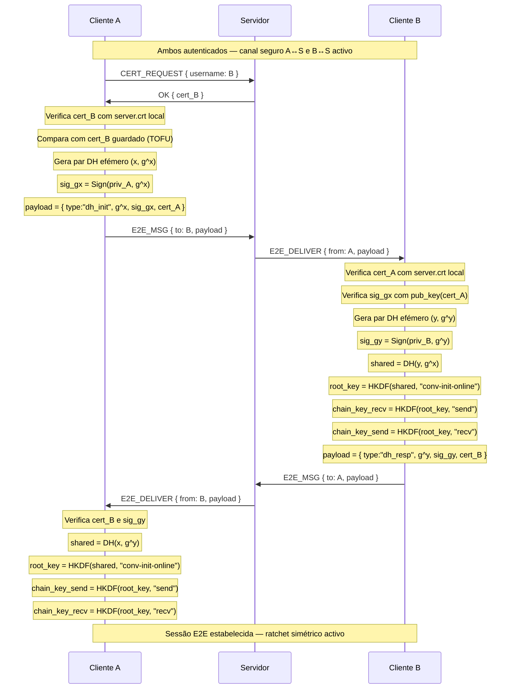

### Estabelecimento de Sessão — Caso Offline com Prekeys
Quando B está offline, não é possível realizar a troca DH interactiva. Para permitir que A inicie uma sessão mesmo assim, B deposita antecipadamente no servidor uma tabela de prekeys: pares DH efémeros pré-gerados, cada um assinado com a chave privada RSA de B, identificados por um índice.

O fluxo é o seguinte:

1. No momento do login, B gera 25 pares DH efémeros (y_i, g^y_i), assina cada um como Sign(priv_B, g^y_i || i), e envia a tabela ao servidor.
2. Quando A quer iniciar uma sessão com B offline, pede ao servidor uma prekey de B. O servidor devolve { idx, g^y_idx, sig_idx, cert_B } e remove essa prekey da tabela (porque é de uso único).
3. A verifica o certificado de B e a assinatura sobre g^y_idx. Gera um par DH efémero próprio (x, g^x) e calcula o segredo:

```c
shared      = DH(x, g^y)
root_key    = HKDF(shared, "conv-init")
chain_key_A = HKDF(root_key, "send")
chain_key_B = HKDF(root_key, "recv")
```

É relevante mencionar que a assinatura de A sobre (g^x || idx) é importante pois liga o valor DH efémero à prekey específica que foi usada, impedindo que um atacante substitua g^x por um valor seu e force um segredo diferente.

Tal como anteriormente, a lógica de sequência é bastante complexa, e por isso foi desenvolvido o seguinte diagrama que descreve o fluxo de troca de dados:

```mermaid
sequenceDiagram
    participant A as Cliente A
    participant S as Servidor
    participant B as Cliente B

    rect rgb(40, 60, 80)
        Note over B,S: No login de B — upload de prekeys
        Note over B: Para i = 0..24:
        Note over B:   Gera (y_i, g^y_i)
        Note over B:   sig_i = Sign(priv_B, g^y_i || i)
        B->>S: PREKEY_UPLOAD { [ {idx, g^y_i, sig_i} ] }
        S->>B: OK
        Note over B: B fica offline
    end

    rect rgb(60, 40, 80)
        Note over A,S: A inicia sessão com B offline
        A->>S: PREKEY_REQUEST { username: B }
        S->>A: PREKEY_BUNDLE { idx, g^y_idx, sig_idx, cert_B }
        Note over S: Prekey idx removida da tabela (uso único)

        Note over A: Verifica cert_B com server.crt local
        Note over A: Verifica sig_idx com pub_key(cert_B)
        Note over A: Gera par DH efémero (x, g^x)
        Note over A: shared = DH(x, g^y_idx)
        Note over A: root_key = HKDF(shared, "conv-init")
        Note over A: chain_key_send = HKDF(root_key, "send")
        Note over A: chain_key_recv = HKDF(root_key, "recv")
        Note over A: sig_gx = Sign(priv_A, g^x || idx)
        Note over A: payload = { type:"init", g^x, idx, sig_gx, cert_A }

        A->>S: E2E_MSG { to: B, payload }
        Note over S: Mensagem enfileirada — B offline
    end

    rect rgb(40, 60, 80)
        Note over B,S: B volta a ficar online — recebe mensagens em fila
        S->>B: E2E_DELIVER { from: A, payload }

        Note over B: Verifica cert_A com server.crt local
        Note over B: Verifica sig_gx com pub_key(cert_A)
        Note over B: Recupera y_idx (chave privada da prekey idx)
        Note over B: shared = DH(y_idx, g^x)
        Note over B: root_key = HKDF(shared, "conv-init")
        Note over B: chain_key_recv = HKDF(root_key, "send")
        Note over B: chain_key_send = HKDF(root_key, "recv")
    end

    Note over A,B: Sessão E2E estabelecida — ratchet simétrico activo
```


### Ratchet Simétrico e Cifragem de Mensagens
Uma vez estabelecidas as _chain_key_ de envio e recepção, as mensagens são cifradas com um ratchet simétrico. Para cada mensagem enviada, o remetente avança o ratchet:

```c
msg_key       = HMAC-SHA256(chain_key, "message")
chain_key_n   = HMAC-SHA256(chain_keyn-1, "chain")     
nonce         = counter.to_bytes(12, 'big')
ciphertext    = AES-256-GCM(msg_key, nonce, plaintext, aad=counter)

```

O contador, tal como na comunicação com o servidor, serve simultaneamente como nonce do AES-GCM e como protecção anti-replay, pois o recetor rejeita qualquer mensagem com contador igual ou inferior ao último processado.

A autenticidade de cada mensagem é garantida pela próprio tag de autenticação do AES-GCM: se a decifragem for bem-sucedida, a mensagem só pode ter sido produzida por alguém que conhece a _msg_key_ corrente, e essa chave só é acessível a quem detém a _chain_key_ partilhada estabelecida no início da sessão.

O ratchet simétrico garante *forward secrecy* ao nível da mensagem pois: 
- cada _chain_key_ é descartada e substituída pela seguinte, logo comprometer o estado actual não permite recuperar mensagens anteriores
- as _msg_key_ individuais são descartadas após decifrar, e as chaves de mensagens futuras não podem ser derivadas sem conhecer a _chain_key_ actual.

O sistema suporta ainda mensagens fora de ordem: se uma mensagem com contador n+k chegar antes de n, as _msg_key_ intermédias são calculadas e guardadas em cache (até um máximo de 1000), sendo descartadas quando as mensagens correspondentes chegarem ou quando se tornar evidente que nunca chegarão.


```mermaid
sequenceDiagram
    participant A as Cliente A
    participant S as Servidor
    participant B as Cliente B

    Note over A,B: Sessão estabelecida — chain_key_send_A, chain_key_recv_B

    rect rgb(40, 60, 80)
        Note over A,B: Mensagem 1 — A → B
        Note over A: msg_key        = HMAC(chain_key_send, "message")
        Note over A: chain_key_send  = HMAC(chain_key_send, "chain")
        Note over A: nonce          = counter.to_bytes(12)
        Note over A: ct             = AES-256-GCM(msg_key, nonce, plaintext, aad=counter)
        A->>S: E2E_MSG { to: B, payload: {counter, ct} }
        S->>B: E2E_DELIVER { from: A, payload }
        Note over B: Verifica counter > counter_recv
        Note over B: msg_key        = HMAC(chain_key_recv, "message")
        Note over B: chain_key_recv  = HMAC(chain_key_recv, "chain")
        Note over B: plaintext      = AES-256-GCM-Decrypt(msg_key, nonce, ct)
        Note over B: tag GCM válido → autenticidade garantida
    end

    rect rgb(40, 60, 80)
        Note over A,B: Mensagem 2 — B → A
        Note over B: msg_key        = HMAC(chain_key_send, "message")
        Note over B: chain_key_send  = HMAC(chain_key_send, "chain")
        Note over B: ct             = AES-256-GCM(msg_key, nonce, plaintext, aad=counter)
        B->>S: E2E_MSG { to: A, payload: {counter, ct} }
        S->>A: E2E_DELIVER { from: B, payload }
        Note over A: msg_key        = HMAC(chain_key_recv, "message")
        Note over A: chain_key_recv  = HMAC(chain_key_recv, "chain")
        Note over A: plaintext      = AES-256-GCM-Decrypt(msg_key, nonce, ct)
        Note over A: tag GCM válido → autenticidade garantida
    end

    Note over A,B: chain_key e msg_key anteriores descartadas
    Note over A,B: mensagens passadas irrecuperáveis sem estado anterior
```


## Modo de Grupo

### Estratégia

A abordagem de ratchet duplo usada na comunicação par-a-par não é escalável para grupos: num grupo de N membros, cada um teria de manter N-1 sessões independentes e cifrar cada mensagem N-1 vezes — uma operação para cada destinatário. Em grupos grandes, este custo tornar-se-ia proibitivo. 

A solução adoptada foi a do modelo de Sender Keys, inspirado no protocolo Signal para grupos. Neste modelo, cada membro possui a sua própria _sender key_ — um estado de ratchet simétrico independente — com a qual cifra todas as mensagens que envia ao grupo. Essa sender key é distribuída uma única vez a cada um dos outros membros e, a partir daí, cada mensagem é cifrada apenas uma vez pelo remetente, podendo ser decifrada por qualquer membro que possua a sender key correspondente. Esta abordagem desacopla o custo de envio do tamanho do grupo: o remetente cifra uma vez, e o servidor reencaminha o mesmo ciphertext a todos os destinatários, diminuindo assim a complexidade de cifragem em relação à abordagem de ratchet duplo.

### Estrutura da Sender Key
Cada sender key é composta por dois elementos distintos:

- Uma _chain key_ simétrica de 256 bits, que serve de raiz a um ratchet simétrico análogo ao do canal par-a-par. A partir desta são derivadas as chaves de mensagem individuais, com a propriedade de _forward secrecy_ ao nível da mensagem.

- Um par de chaves RSA dedicado, usado exclusivamente para assinar as mensagens enviadas ao grupo com esta sender key. Este par é distinto da chave de identidade RSA do utilizador (usada nos certificados e na autenticação perante o servidor) e é regenerado sempre que a sender key é renovada (por exemplo, na sequência de uma expulsão ou saída de membro).

A separação entre a chave de identidade e a chave de assinatura da sender key é deliberada e tem duas justificações:

- Em primeiro lugar, limita o impacto de um eventual comprometimento: se a chave dedicada da sender key for exposta, o atacante pode forjar mensagens dessa sender key específica, mas não consegue personificar o utilizador noutros contextos (autenticação perante o servidor, estabelecimento de sessões E2E par-a-par, etc.).

- Em segundo lugar, permite que a rotação da _sender key_ após mudanças de membros no grupo seja completa e independente, já que o utilizador gera um par RSA novo juntamente com a nova _sender key_, sem necessidade de envolver o par de chaves "principal".

#### Criação do Grupo
O criador do grupo é responsável pela sua iniciação. Ao criar o grupo, gera imediatamente a sua sender key — composta por uma _chain key_ aleatória e um par RSA dedicado para assinatura. De seguida, distribui esta sender key individualmente a cada membro convidado, enviando-a cifrada através do canal E2E par-a-par previamente estabelecido com cada um deles. Esquematizando, fica:


```mermaid
sequenceDiagram
    participant D as Criador (A)
    participant S as Servidor
    participant B as Membro B
    participant C as Membro C

    rect rgb(40, 60, 80)
        Note over D,C: Criação do grupo e distribuição de sender keys
        D->>S: CREATE_GROUP { nome, [B, C] }
        S->>D: OK
        Note over D: Gera sender key própria
        Note over D: SK_A = { chain_key_A (random 256b), sig_priv_A, sig_pub_A }
        Note over D: Envia SK_A a B pelo canal E2E par-a-par
        D->>S: E2E_MSG { to: B, sk_dist(SK_A) }
        S->>B: E2E_DELIVER { from: A, sk_dist(SK_A) }
        Note over B: Canal E2E autentica origem — tag GCM válido
        Note over B: Guarda SK_A localmente
        Note over D: Envia SK_A a C pelo canal E2E par-a-par
        D->>S: E2E_MSG { to: C, sk_dist(SK_A) }
        S->>C: E2E_DELIVER { from: A, sk_dist(SK_A) }
        Note over C: Canal E2E autentica origem — tag GCM válido
        Note over C: Guarda SK_A localmente
    end

```

#### Aceitação de Convite
Quando um membro aceita o convite para se juntar ao grupo, executa dois passos simétricos:

1. Gera a sua própria _sender key_ (nova _chain key_ aleatória e novo par RSA dedicado) e distribui-a a todos os membros atuais do grupo através dos respectivos canais E2E par-a-par.
2. Recebe, pelos mesmos canais, as sender keys de cada um dos outros membros, armazenando-as localmente.

Após esta troca, o novo membro fica habilitado a enviar mensagens ao grupo (com a sua _sender key_) e a decifrar mensagens dos restantes membros (com as _sender keys_ que recebeu). Para demonstrar isto, foi desenvolvido o seguinte diagrama:

```mermaid
sequenceDiagram
    participant D as Criador (A)
    participant S as Servidor
    participant B as Membro B
    participant C as Membro C
     rect rgb(40, 80, 40)
          Note over D,C: B aceita o convite — gera e distribui a sua sender key
          B->>S: ACCEPT_GROUP { grupo }
          S->>B: OK
          Note over B: Gera sender key própria
          Note over B: SK_B = { chain_key_B (random 256b), sig_priv_B, sig_pub_B }
          B->>S: E2E_MSG { to: A, sk_dist(SK_B) }
          S->>D: E2E_DELIVER { from: B, sk_dist(SK_B) }
          Note over D: Guarda SK_B localmente
          B->>S: E2E_MSG { to: C, sk_dist(SK_B) }
          S->>C: E2E_DELIVER { from: B, sk_dist(SK_B) }
          Note over C: Guarda SK_B localmente
     end
```

#### Envio de Mensagem
Para cada mensagem enviada ao grupo, o remetente avança o seu ratchet simétrico, deriva a chave de mensagem, cifra e assina:

```c
msg_key    = HMAC-SHA256(chain_key, "message")
chain_key  = HMAC-SHA256(chain_key, "chain")
nonce      = counter.to_bytes(12, 'big')
ct         = AES-256-GCM(msg_key, nonce, plaintext, aad=counter)
sig        = Sign(sender_key_priv, ct || counter || group_name)

```

A mensagem { counter, ct, sig } é entregue ao servidor como um _blob_ opaco, que retransmite-a a todos os membros online e a enfileira para os offline até que estes voltar a conectar-se.

O _counter_ desempenha um papel duplo: serve como nonce do AES-GCM (garantindo unicidade da cifra) e como mecanismo de protecção contra replay — mensagens com counter igual ou inferior ao último processado são rejeitadas pelo recetor.

O _ratchet_ tolera mensagens fora de ordem: se uma mensagem com counter n+k chegar antes da mensagem com _counter_ n, as _msg_key_ intermédias são calculadas e armazenadas em cache até serem consumidas pelas mensagens correspondentes. Esta cache tem um limite máximo de 1000 entradas por membro, protegendo contra ataques de negação de serviço em que um atacante enviaria mensagens com counter artificialmente elevado para forçar a derivação massiva de chaves. Tal como feito anteriormente, foi desenvolvido um diagrama que demonstra esta troca de mensagens:

```mermaid
sequenceDiagram
    participant D as Criador (A)
    participant S as Servidor
    participant B as Membro B
    participant C as Membro C
rect rgb(40, 60, 80)
        Note over D,C: Envio de mensagem de grupo — A envia para todos
        Note over D: msg_key    = HMAC(chain_key_A, "message")
        Note over D: chain_key_A = HMAC(chain_key_A, "chain")
        Note over D: ct         = AES-256-GCM(msg_key, nonce, plaintext, aad=counter)
        Note over D: sig        = Sign(sig_priv_A, ct || counter || grupo)
        D->>S: GROUP_MSG { grupo, {counter, ct, sig} }
        S->>B: GROUP_DELIVER { from: A, {counter, ct, sig} }
        S->>C: GROUP_DELIVER { from: A, {counter, ct, sig} }
        Note over B: 1. Verifica sig com sig_pub_A (da SK_A recebida)
        Note over B: 2. msg_key = HMAC(chain_key_A_recv, "message")
        Note over B: 3. plaintext = AES-256-GCM-Decrypt(msg_key, nonce, ct)
        Note over C: 1. Verifica sig com sig_pub_A
        Note over C: 2. plaintext = AES-256-GCM-Decrypt(...)
    end

```

### Mudanças de membros
#### Entrada de Novo Membro
No caso da entrada de um novo membro, não é necessária a rotação das _sender keys_ existentes. O fluxo é deliberadamente simples: o novo membro recebe as _sender keys_ actuais de cada membro existente, no estado corrente do ratchet de cada um.

Esta abordagem tem uma propriedade importante: o novo membro consegue decifrar mensagens enviadas a partir do momento em que recebe cada _sender key_, mas não tem acesso a mensagens passadas, pois as _chain keys_ anteriores foram descartadas pelo _ratchet_ à medida que avançou. Assim, a confidencialidade do histórico anterior à entrada é preservada sem necessidade de operações criptográficas adicionais por parte dos membros existentes.

#### Saída ou Expulsão de Membro
Esta é a operação mais sensível do modelo de Sender Keys. Quando um membro sai do grupo, mantém em sua posse as _sender keys_ atuais de todos os outros membros, que poderia usar para continuar a decifrar mensagens futuras se nenhuma medida fosse tomada.

Para garantir que mensagens enviadas após a saída ficam inacessíveis ao ex-membro, é necessário que todos os membros remanescentes rodem as suas _sender keys_:

1. O cliente que inicia a operação (saída voluntária ou expulsão) envia o pedido ao servidor.
2. O servidor remove o membro da lista do grupo e responde com OK ao solicitante.
3. O servidor envia uma notificação GROUP_MEMBER_LEFT a todos os membros remanescentes que estejam online, identificando quem saiu e de que grupo. Para membros offline, a notificação é enfileirada e entregue na próxima ligação.
4. Cada membro remanescente, ao receber a notificação, executa autonomamente:

    - Descarta completamente as suas _sender keys_ atuais — apaga-as da memória e do disco, incluindo a _chain key_ e o par RSA dedicado.
    - Gera uma nova _sender key_ do zero, com nova _chain key_ aleatória e novo par RSA dedicado.
    - Distribui esta nova _sender key_ a todos os outros membros remanescentes através dos canais E2E par-a-par.

5. Mensagens enviadas a partir deste momento usam as novas _sender keys_, cujo material criptográfico nunca esteve na posse do membro removido.

Esta arquitectura garante a propriedade de _forward secrecy_ face ao ex-membro, pois mensagens futuras são inacessíveis a quem deixou o grupo. Só que o custo é uma operação proporcional a N × (N-1) distribuições E2E (cada um dos N-1 membros restantes envia a sua nova sender key aos outros N-2). Para grupos de tamanho moderado, este custo é considerado aceitável.

É importante notar uma limitação inerente ao modelo: o ex-membro conserva a capacidade de decifrar mensagens passadas que tenha gravado localmente enquanto era membro do grupo, já que não existe mecanismo criptográfico que o impeça, pois o ex-membro era um destinatário legítimo dessas mensagens no momento em que foram enviadas. Devido à complexidade desta operação, foi também desenvolvido um diagrama que a representa:


```mermaid
sequenceDiagram
    participant D as Criador (A)
    participant S as Servidor
    participant B as Membro B
    participant C as Membro C
   rect rgb(80, 40, 40)
        Note over D,C: Expulsão de C — rotação por todos os membros remanescentes
        D->>S: KICK { grupo, C }
        S->>D: OK
        S->>B: GROUP_MEMBER_LEFT { grupo, C }
        Note over S: C removido da lista de destinatários
        Note over D: Recebe GROUP_MEMBER_LEFT
        Note over D: Descarta SK_A da memória e do disco
        Note over D: Gera nova SK_A' (chain_key nova + novo par RSA)
        D->>S: E2E_MSG { to: B, sk_dist(SK_A') }
        S->>B: E2E_DELIVER { from: A, sk_dist(SK_A') }
        Note over B: Recebe GROUP_MEMBER_LEFT
        Note over B: Descarta SK_B da memória e do disco
        Note over B: Gera nova SK_B' (chain_key nova + novo par RSA)
        B->>S: E2E_MSG { to: A, sk_dist(SK_B') }
        S->>D: E2E_DELIVER { from: B, sk_dist(SK_B') }
        Note over D,B: Mensagens futuras usam SK_A' e SK_B'
        Note over D,B: C não tem acesso a nenhuma das novas sender keys
    end
```

## Mensagens Offline
Ao longo dos capítulos anteriores foram descritos vários contextos em que mensagens podem ser enviadas e recebidas. Em todos eles, a comunicação entre cliente e servidor decorre dentro do canal seguro estabelecido pelo handshake DH — cifrado com AES-256-GCM com chaves derivadas por HKDF —, pelo que o conteúdo de qualquer troca de dados é opaco ao servidor do ponto de vista da rede. Contudo, tal como escrito no enunciado, o servidor é honesto mas curioso, logo deve-se garantir que ele não é capaz de consultar mensagens que por ele passem.

No entanto, quando o destinatário de uma mensagem está offline, o servidor tem necessariamente de a guardar temporariamente até que este volte a ligar-se. As situações em que isto ocorre são as seguintes:

- *Mensagens E2E par-a-par:* o payload enviado pelo remetente é um _blob_ cifrado com a sessão E2E estabelecida entre os dois clientes. O servidor armazena-o sem qualquer capacidade de o decifrar, pois não possui as chaves de sessão nem as _chain keys_ do _ratchet_, que existem apenas na memória dos dois intervenientes.

- *Mensagens de grupo:* o payload enviado ao servidor é igualmente um _blob_ opaco, cifrado com a _msg key_ derivada da _sender key_ do remetente. Como o servidor não tem acesso às _sender keys_ de nenhum membro (pois estas são distribuídas exclusivamente através dos canais E2E par-a-par), o conteúdo das mensagens de grupo é igualmente inacessível.

- *Distribuição de sender keys:* quando um membro está offline no momento em que outro distribui a sua sender key (por exemplo, durante a criação do grupo ou após uma rotação), o payload de distribuição é enfileirado pelo servidor como qualquer outra mensagem E2E. O servidor armazena-o sem o conseguir interpretar, uma vez que está cifrado pelo canal E2E par-a-par entre os dois clientes.

- *Distribuição de prekeys:* as prekeys são pares DH efémeros assinados pelo cliente, depositados no servidor antes de este ficar offline. O servidor armazena apenas os valores públicos e as assinaturas.

Assim, em todos estes casos, o servidor actua como um intermediário cego, pois recebe, guarda e entrega _blobs_ que não consegue decifrar. Com isto, garante-se que ele não é capaz de verificar o conteúdo de mensagens das quais não seja o remetente (visto não ter mais do que as chaves efémeras estabelecidas entre ele e os clientes que a ele se ligam).

# Melhorias
A nosso ver, no que toca à segurança, a implementação do sistema poderia ter algumas melhorias nas suas capacidades, nomeadamente:

- *Post-Compromise Security via Renovação Periódica do Segredo* - o ratchet simétrico implementado nos canais E2E par-a-par garante _forward secrecy_ ao nível da mensagem, mas não _post-compromise security_, já que se um atacante conseguir extrair o estado atual de uma conversa, todas as mensagens futuras dessa conversa permanecem comprometidas até a sessão ser reestabelecida manualmente.

- *Revogação de Certificados* - o sistema atual assume que os certificados emitidos durante o registo são válidos indefinidamente. Não existe mecanismo de revogação para cenários em que a chave privada de um utilizador seja comprometida, permitindo que um atacante pudesse continuar a usar o certificado roubado para se autenticar.

- *Suporte a vários dispositivos* - a arquitectura atual assume um único dispositivo por utilizador e o suporte de múltiplos dispositivos do mesmo utilizador (telemóvel, computador, etc.) introduziria desafios significativos.

- *Recuperação de Conta* - caso um utilizador perca a sua password ou o ficheiro com a chave privada, perde definitivamente o acesso à conta.

- *Resistência a Análise de Tráfego* - o sistema cifra o conteúdo das mensagens mas não esconde metadados visíveis ao servidor: quem comunica com quem, com que frequência, em que momentos, e o tamanho aproximado das mensagens.

- *Migração para Algoritmos Pós-Quânticos* - a criptografia adotada (RSA-2048, DH clássico, AES-256, SHA-256) é segura face a adversários clássicos mas não a computadores quânticos, já que o RSA e DH são particularmente vulneráveis ao algoritmo de Shor. Numa implementação preocupada com o futuro, seria justificável adotar primitivas pós-quânticas.

- *Limite Máximo de Pre-Keys e Estratégia de Reposição* - a implementação actual gera 25 pre-keys no login, mas não inclui um mecanismo automático de reposição quando o stock se aproxima do esgotamento. Num cenário de utilização intensiva, isto poderia levar à recusa de novas sessões offline até o utilizador voltar a ligar-se.

- *Escalabilidade dos Membership Changes em Grupos* - o modelo de Sender Keys adotado tem complexidade O(N²) na rotação de sender keys após uma expulsão. Para grupos de tamanho moderado este custo é aceitável, mas torna-se proibitivo em grupos com centenas ou milhares de membros.

Contudo, todas as soluções necessárias para estes problemas/dificuldades envolveriam preocupações foram do âmbito do projeto, logo, a sua resolução não traria muitos benefícios para o objetivo do problema e seria bastante custosa e difícil. Assim sendo, apesar do projeto desenvolvido ser funcional e corresponder às exigências prospostas pelo enunciado, a equipa de desenvolvimento está ciente de que se encontra longe de uma solução muito ineficiente para ser usada num caso de uso real.

Para além das possíveis melhorias acima descritas, a implementação dos programas do servidor e do cliente poderiam ter sido feitas aplicando conhecimento de Sistemas Distribuídos, como por exemplo, a adoção de uma arquitetura com Thread Pool no servidor e de um Demultiplexer no cliente, melhorando bastante a capacidade de execução e eficiência do programa. Contudo, como este não era o objetivo do projeto e a adoção destas arquiteturas teria de ser feita com uma _Trusted Computing Base_ já substancialmente grande para a equipa, decidimos não fazê-lo.


Para além disso, a implementação dos programas do servidor e do cliente poderiam ter sido feitas aplicando conhecimento de Sistemas Distribuídos, como por exemplo, a adoção de uma arquitetura com _Thread Pool_ no servidor e de um _Demultiplexer_ no cliente, melhorando bastante a capacidade de execução e eficiência do programa. Contudo, como este não era o objetivo do projeto e a adoção destas arquiteturas teria de ser feita com uma _Trusted Computing Base_ já substancialmente grande para a equipa, decidimos não fazê-lo.

# Conclusão
Em suma, o presente projecto resultou no desenvolvimento de um sistema de conversação seguro que cumpre os requisitos estipulados no enunciado, abordando os três modos de funcionamento previstos: comunicação centralizada com o servidor, comunicação descentralizada par-a-par entre clientes, e comunicação em grupo.

Ao longo do desenvolvimento, o sistema foi sendo iterado consideravelmente. As primeiras versões da arquitectura assentavam em decisões que, embora funcionais, revelavam fragilidades face ao modelo de ameaça pretendido — nomeadamente a ausência de Perfect Forward Secrecy no estabelecimento inicial de canais. Esta consciencialização levou à adopção do protocolo Station-to-Station no handshake entre cliente e servidor, e de uma abordagem X3DH-like no estabelecimento de sessões entre clientes. A camada de cifragem de mensagens evoluiu também para um ratchet simétrico, garantindo forward secrecy ao nível da mensagem individual em vez de apenas ao nível da sessão.

No modo de grupo, optou-se pelo modelo de Sender Keys inspirado no protocolo Signal, com assinaturas digitais por mensagem para garantir autenticação de origem num contexto multi-remetente. A separação entre chave de identidade e chave dedicada à sender key, bem como a rotação completa por parte de todos os membros remanescentes após a saída ou expulsão de um membro, foram decisões cuidadosas para garantir as propriedades de segurança desejadas mesmo em situações operacionais complexas.

A equipa está consciente de que o sistema, embora funcional e alinhado com o estado da arte em diversos aspectos, está longe de uma solução pronta para utilização em produção. Algumas das limitações conhecidas — desde a ausência de post-compromise security, passando pela falta de mecanismos de revogação de certificados, até à inexistência de suporte a múltiplos dispositivos — foram identificadas e documentadas na secção de melhorias. A resolução de cada uma envolveria preocupações e complexidades fora do âmbito do projecto, mas a sua identificação revela uma consciência crítica do trabalho e dos seus limites.

O processo de desenvolvimento permitiu à equipa aprofundar significativamente os conhecimentos em criptografia aplicada, particularmente na composição de primitivas para garantir propriedades de segurança que nenhuma delas oferece isoladamente — forward secrecy, autenticação mútua, resistência a replay, autenticação de origem em grupos. A versão final apresentada responde de forma consistente ao que foi pedido, e o grupo considera-se satisfeito com o resultado, reconhecendo que cada decisão técnica foi tomada com justificação clara e consciência dos trade-offs envolvidos.