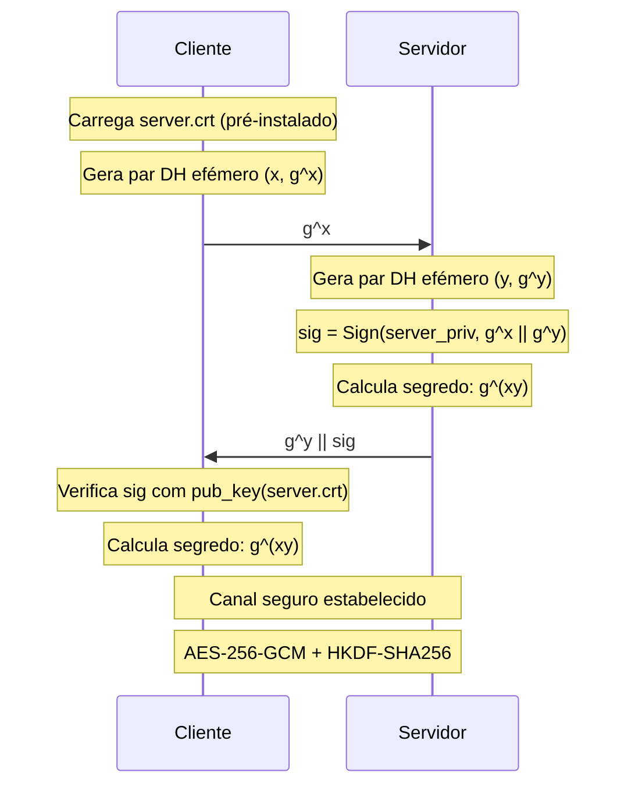

```mermaid
sequenceDiagram
    participant C as Cliente
    participant S as Servidor

    Note over C: Carrega server.crt (pré-instalado)
    Note over C: Gera par DH efémero (x, g^x)

    C->>S: g^x

    Note over S: Gera par DH efémero (y, g^y)
    Note over S: sig = Sign(server_priv, g^x || g^y)
    Note over S: Calcula segredo: g^(xy)

    S->>C: g^y || sig

    Note over C: Verifica sig com pub_key(server.crt)
    Note over C: Calcula segredo: g^(xy)

    Note over C,S: Canal seguro estabelecido
    Note over C,S: AES-256-GCM + HKDF-SHA256
```
