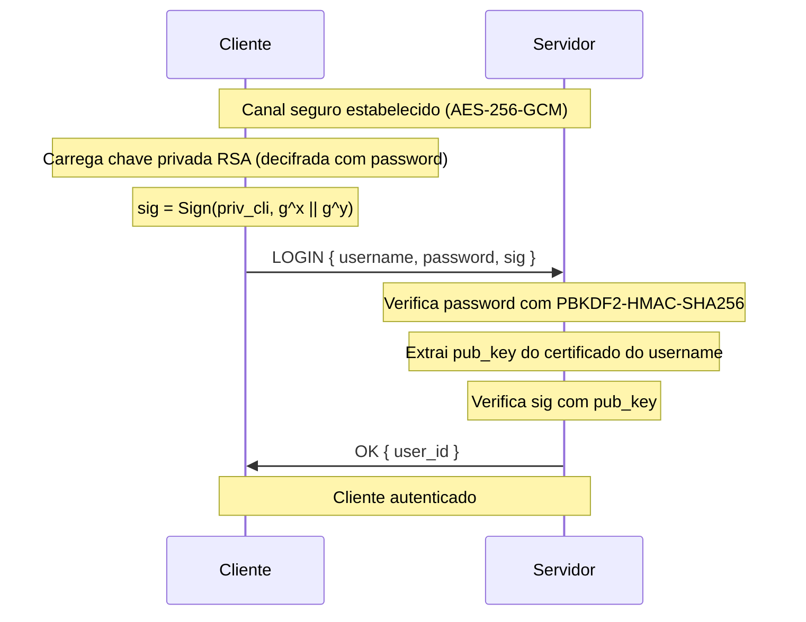

```mermaid
sequenceDiagram
    participant C as Cliente
    participant S as Servidor

    Note over C,S: Canal seguro estabelecido (AES-256-GCM)

    Note over C: Carrega chave privada RSA (decifrada com password)
    Note over C: sig = Sign(priv_cli, g^x || g^y)

    C->>S: LOGIN { username, password, sig }

    Note over S: Verifica password com PBKDF2-HMAC-SHA256
    Note over S: Extrai pub_key do certificado do username
    Note over S: Verifica sig com pub_key

    S->>C: OK { user_id }

    Note over C,S: Cliente autenticado
```
