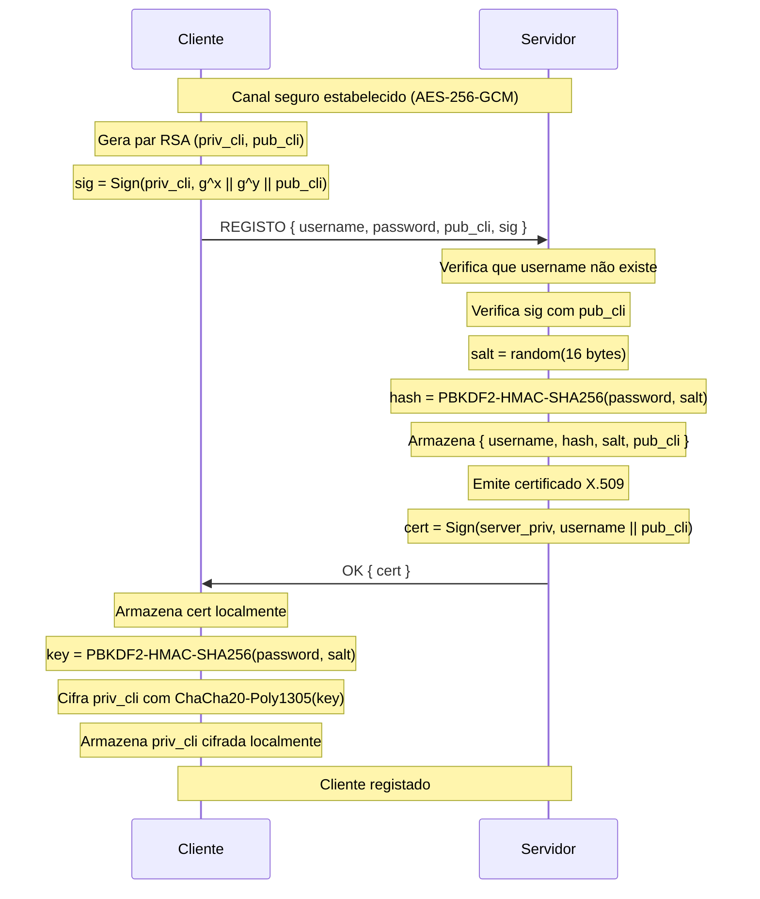

```mermaid
sequenceDiagram
    participant C as Cliente
    participant S as Servidor

    Note over C,S: Canal seguro estabelecido (AES-256-GCM)

    Note over C: Gera par RSA (priv_cli, pub_cli)
    Note over C: sig = Sign(priv_cli, g^x || g^y || pub_cli)

    C->>S: REGISTO { username, password, pub_cli, sig }

    Note over S: Verifica que username não existe
    Note over S: Verifica sig com pub_cli
    Note over S: salt = random(16 bytes)
    Note over S: hash = PBKDF2-HMAC-SHA256(password, salt)
    Note over S: Armazena { username, hash, salt, pub_cli }
    Note over S: Emite certificado X.509
    Note over S: cert = Sign(server_priv, username || pub_cli)

    S->>C: OK { cert }

    Note over C: Armazena cert localmente
    Note over C: key = PBKDF2-HMAC-SHA256(password, salt)
    Note over C: Cifra priv_cli com ChaCha20-Poly1305(key)
    Note over C: Armazena priv_cli cifrada localmente

    Note over C,S: Cliente registado
```
