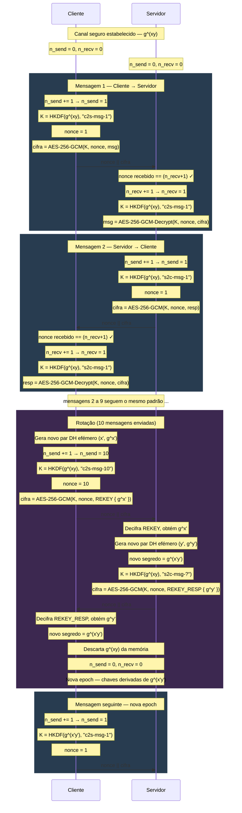

```mermaid
sequenceDiagram
    participant C as Cliente
    participant S as Servidor

    Note over C,S: Canal seguro estabelecido — g^(xy)

    Note over C: n_send = 0, n_recv = 0
    Note over S: n_send = 0, n_recv = 0

    rect rgb(40, 60, 80)
        Note over C,S: Mensagem 1 — Cliente → Servidor
        Note over C: n_send += 1  →  n_send = 1
        Note over C: K = HKDF(g^(xy), "c2s-msg-1")
        Note over C: nonce = 1
        Note over C: cifra = AES-256-GCM(K, nonce, msg)
        C->>S: nonce || cifra
        Note over S: nonce recebido == (n_recv+1) ✓
        Note over S: n_recv += 1  →  n_recv = 1
        Note over S: K = HKDF(g^(xy), "c2s-msg-1")
        Note over S: msg = AES-256-GCM-Decrypt(K, nonce, cifra)
    end

    rect rgb(40, 60, 80)
        Note over C,S: Mensagem 2 — Servidor → Cliente
        Note over S: n_send += 1  →  n_send = 1
        Note over S: K = HKDF(g^(xy), "s2c-msg-1")
        Note over S: nonce = 1
        Note over S: cifra = AES-256-GCM(K, nonce, resp)
        S->>C: nonce || cifra
        Note over C: nonce recebido == (n_recv+1) ✓
        Note over C: n_recv += 1  →  n_recv = 1
        Note over C: K = HKDF(g^(xy), "s2c-msg-1")
        Note over C: resp = AES-256-GCM-Decrypt(K, nonce, cifra)
    end

    Note over C,S: mensagens 2 a 9 seguem o mesmo padrão ...

    rect rgb(60, 40, 80)
        Note over C,S: Rotação (10 mensagens enviadas)
        Note over C: Gera novo par DH efémero (x', g^x')
        Note over C: n_send += 1  →  n_send = 10
        Note over C: K = HKDF(g^(xy), "c2s-msg-10")
        Note over C: nonce = 10
        Note over C: cifra = AES-256-GCM(K, nonce, REKEY { g^x' })
        C->>S: nonce || cifra
        Note over S: Decifra REKEY, obtém g^x'
        Note over S: Gera novo par DH efémero (y', g^y')
        Note over S: novo segredo = g^(x'y')
        Note over S: K = HKDF(g^(xy), "s2c-msg-?")
        Note over S: cifra = AES-256-GCM(K, nonce, REKEY_RESP { g^y' })
        S->>C: nonce || cifra
        Note over C: Decifra REKEY_RESP, obtém g^y'
        Note over C: novo segredo = g^(x'y')
        Note over C,S: Descarta g^(xy) da memória
        Note over C,S: n_send = 0, n_recv = 0
        Note over C,S: Nova epoch — chaves derivadas de g^(x'y')
    end

    rect rgb(40, 60, 80)
        Note over C,S: Mensagem seguinte — nova epoch
        Note over C: n_send += 1  →  n_send = 1
        Note over C: K = HKDF(g^(x'y'), "c2s-msg-1")
        Note over C: nonce = 1
        C->>S: nonce || cifra
    end
```
