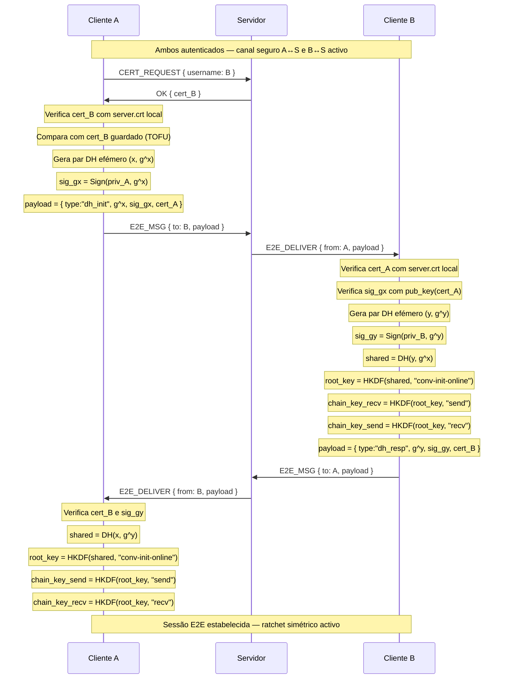

```mermaid
sequenceDiagram
    participant A as Cliente A
    participant S as Servidor
    participant B as Cliente B

    Note over A,B: Ambos autenticados — canal seguro A↔S e B↔S activo

    A->>S: CERT_REQUEST { username: B }
    S->>A: OK { cert_B }

    Note over A: Verifica cert_B com server.crt local
    Note over A: Compara com cert_B guardado (TOFU)
    Note over A: Gera par DH efémero (x, g^x)
    Note over A: sig_gx = Sign(priv_A, g^x)
    Note over A: payload = { type:"dh_init", g^x, sig_gx, cert_A }

    A->>S: E2E_MSG { to: B, payload }
    S->>B: E2E_DELIVER { from: A, payload }

    Note over B: Verifica cert_A com server.crt local
    Note over B: Verifica sig_gx com pub_key(cert_A)
    Note over B: Gera par DH efémero (y, g^y)
    Note over B: sig_gy = Sign(priv_B, g^y)
    Note over B: shared = DH(y, g^x)
    Note over B: root_key = HKDF(shared, "conv-init-online")
    Note over B: chain_key_recv = HKDF(root_key, "send")
    Note over B: chain_key_send = HKDF(root_key, "recv")
    Note over B: payload = { type:"dh_resp", g^y, sig_gy, cert_B }

    B->>S: E2E_MSG { to: A, payload }
    S->>A: E2E_DELIVER { from: B, payload }

    Note over A: Verifica cert_B e sig_gy
    Note over A: shared = DH(x, g^y)
    Note over A: root_key = HKDF(shared, "conv-init-online")
    Note over A: chain_key_send = HKDF(root_key, "send")
    Note over A: chain_key_recv = HKDF(root_key, "recv")

    Note over A,B: Sessão E2E estabelecida — ratchet simétrico activo
```
