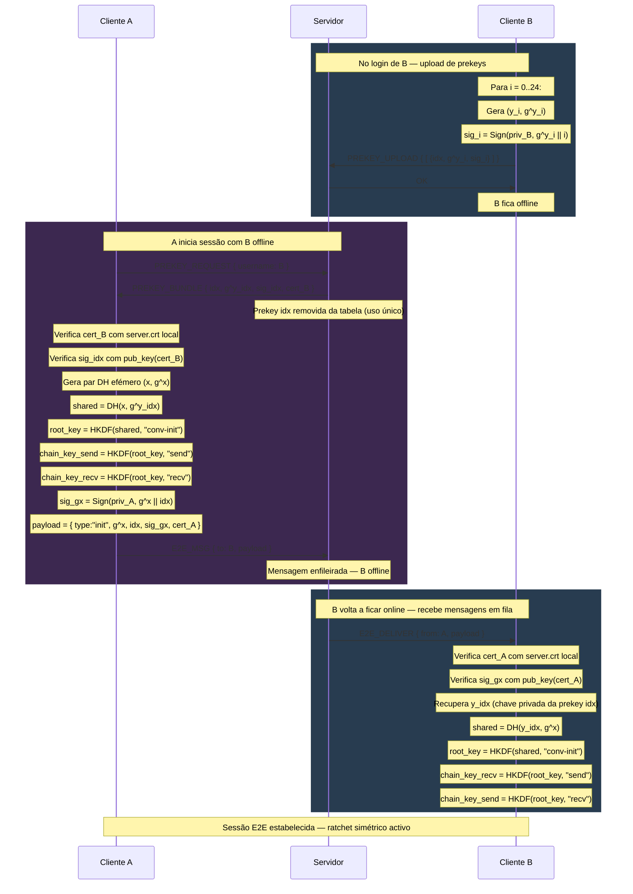

```mermaid
sequenceDiagram
    participant A as Cliente A
    participant S as Servidor
    participant B as Cliente B

    rect rgb(40, 60, 80)
        Note over B,S: No login de B — upload de prekeys
        Note over B: Para i = 0..24:
        Note over B:   Gera (y_i, g^y_i)
        Note over B:   sig_i = Sign(priv_B, g^y_i || i)
        B->>S: PREKEY_UPLOAD { [ {idx, g^y_i, sig_i} ] }
        S->>B: OK
        Note over B: B fica offline
    end

    rect rgb(60, 40, 80)
        Note over A,S: A inicia sessão com B offline
        A->>S: PREKEY_REQUEST { username: B }
        S->>A: PREKEY_BUNDLE { idx, g^y_idx, sig_idx, cert_B }
        Note over S: Prekey idx removida da tabela (uso único)

        Note over A: Verifica cert_B com server.crt local
        Note over A: Verifica sig_idx com pub_key(cert_B)
        Note over A: Gera par DH efémero (x, g^x)
        Note over A: shared = DH(x, g^y_idx)
        Note over A: root_key = HKDF(shared, "conv-init")
        Note over A: chain_key_send = HKDF(root_key, "send")
        Note over A: chain_key_recv = HKDF(root_key, "recv")
        Note over A: sig_gx = Sign(priv_A, g^x || idx)
        Note over A: payload = { type:"init", g^x, idx, sig_gx, cert_A }

        A->>S: E2E_MSG { to: B, payload }
        Note over S: Mensagem enfileirada — B offline
    end

    rect rgb(40, 60, 80)
        Note over B,S: B volta a ficar online — recebe mensagens em fila
        S->>B: E2E_DELIVER { from: A, payload }

        Note over B: Verifica cert_A com server.crt local
        Note over B: Verifica sig_gx com pub_key(cert_A)
        Note over B: Recupera y_idx (chave privada da prekey idx)
        Note over B: shared = DH(y_idx, g^x)
        Note over B: root_key = HKDF(shared, "conv-init")
        Note over B: chain_key_recv = HKDF(root_key, "send")
        Note over B: chain_key_send = HKDF(root_key, "recv")
    end

    Note over A,B: Sessão E2E estabelecida — ratchet simétrico activo
```
