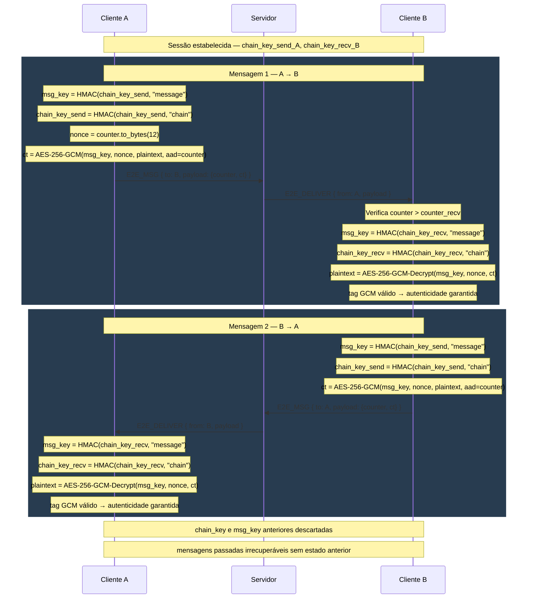

```mermaid
sequenceDiagram
    participant A as Cliente A
    participant S as Servidor
    participant B as Cliente B

    Note over A,B: Sessão estabelecida — chain_key_send_A, chain_key_recv_B

    rect rgb(40, 60, 80)
        Note over A,B: Mensagem 1 — A → B
        Note over A: msg_key        = HMAC(chain_key_send, "message")
        Note over A: chain_key_send  = HMAC(chain_key_send, "chain")
        Note over A: nonce          = counter.to_bytes(12)
        Note over A: ct             = AES-256-GCM(msg_key, nonce, plaintext, aad=counter)
        A->>S: E2E_MSG { to: B, payload: {counter, ct} }
        S->>B: E2E_DELIVER { from: A, payload }
        Note over B: Verifica counter > counter_recv
        Note over B: msg_key        = HMAC(chain_key_recv, "message")
        Note over B: chain_key_recv  = HMAC(chain_key_recv, "chain")
        Note over B: plaintext      = AES-256-GCM-Decrypt(msg_key, nonce, ct)
        Note over B: tag GCM válido → autenticidade garantida
    end

    rect rgb(40, 60, 80)
        Note over A,B: Mensagem 2 — B → A
        Note over B: msg_key        = HMAC(chain_key_send, "message")
        Note over B: chain_key_send  = HMAC(chain_key_send, "chain")
        Note over B: ct             = AES-256-GCM(msg_key, nonce, plaintext, aad=counter)
        B->>S: E2E_MSG { to: A, payload: {counter, ct} }
        S->>A: E2E_DELIVER { from: B, payload }
        Note over A: msg_key        = HMAC(chain_key_recv, "message")
        Note over A: chain_key_recv  = HMAC(chain_key_recv, "chain")
        Note over A: plaintext      = AES-256-GCM-Decrypt(msg_key, nonce, ct)
        Note over A: tag GCM válido → autenticidade garantida
    end

    Note over A,B: chain_key e msg_key anteriores descartadas
    Note over A,B: mensagens passadas irrecuperáveis sem estado anterior
```
