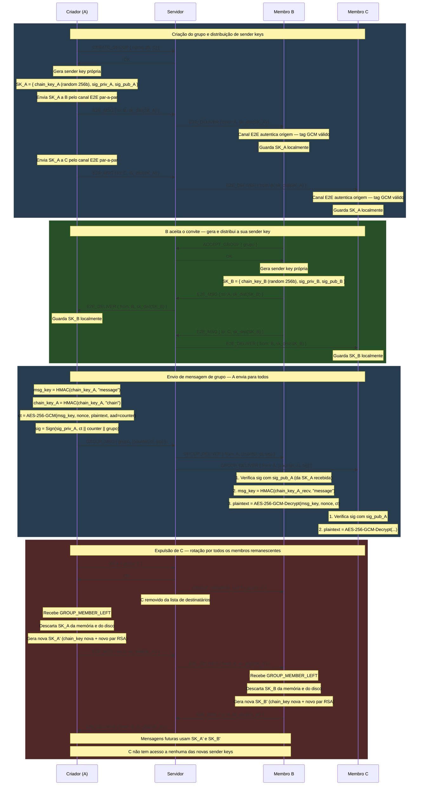

```mermaid
sequenceDiagram
    participant D as Criador (A)
    participant S as Servidor
    participant B as Membro B
    participant C as Membro C

    rect rgb(40, 60, 80)
        Note over D,C: Criação do grupo e distribuição de sender keys
        D->>S: CREATE_GROUP { nome, [B, C] }
        S->>D: OK
        Note over D: Gera sender key própria
        Note over D: SK_A = { chain_key_A (random 256b), sig_priv_A, sig_pub_A }
        Note over D: Envia SK_A a B pelo canal E2E par-a-par
        D->>S: E2E_MSG { to: B, sk_dist(SK_A) }
        S->>B: E2E_DELIVER { from: A, sk_dist(SK_A) }
        Note over B: Canal E2E autentica origem — tag GCM válido
        Note over B: Guarda SK_A localmente
        Note over D: Envia SK_A a C pelo canal E2E par-a-par
        D->>S: E2E_MSG { to: C, sk_dist(SK_A) }
        S->>C: E2E_DELIVER { from: A, sk_dist(SK_A) }
        Note over C: Canal E2E autentica origem — tag GCM válido
        Note over C: Guarda SK_A localmente
    end

    rect rgb(40, 80, 40)
        Note over D,C: B aceita o convite — gera e distribui a sua sender key
        B->>S: ACCEPT_GROUP { grupo }
        S->>B: OK
        Note over B: Gera sender key própria
        Note over B: SK_B = { chain_key_B (random 256b), sig_priv_B, sig_pub_B }
        B->>S: E2E_MSG { to: A, sk_dist(SK_B) }
        S->>D: E2E_DELIVER { from: B, sk_dist(SK_B) }
        Note over D: Guarda SK_B localmente
        B->>S: E2E_MSG { to: C, sk_dist(SK_B) }
        S->>C: E2E_DELIVER { from: B, sk_dist(SK_B) }
        Note over C: Guarda SK_B localmente
    end

    rect rgb(40, 60, 80)
        Note over D,C: Envio de mensagem de grupo — A envia para todos
        Note over D: msg_key    = HMAC(chain_key_A, "message")
        Note over D: chain_key_A = HMAC(chain_key_A, "chain")
        Note over D: ct         = AES-256-GCM(msg_key, nonce, plaintext, aad=counter)
        Note over D: sig        = Sign(sig_priv_A, ct || counter || grupo)
        D->>S: GROUP_MSG { grupo, {counter, ct, sig} }
        S->>B: GROUP_DELIVER { from: A, {counter, ct, sig} }
        S->>C: GROUP_DELIVER { from: A, {counter, ct, sig} }
        Note over B: 1. Verifica sig com sig_pub_A (da SK_A recebida)
        Note over B: 2. msg_key = HMAC(chain_key_A_recv, "message")
        Note over B: 3. plaintext = AES-256-GCM-Decrypt(msg_key, nonce, ct)
        Note over C: 1. Verifica sig com sig_pub_A
        Note over C: 2. plaintext = AES-256-GCM-Decrypt(...)
    end

    rect rgb(80, 40, 40)
        Note over D,C: Expulsão de C — rotação por todos os membros remanescentes
        D->>S: KICK { grupo, C }
        S->>D: OK
        S->>B: GROUP_MEMBER_LEFT { grupo, C }
        Note over S: C removido da lista de destinatários
        Note over D: Recebe GROUP_MEMBER_LEFT
        Note over D: Descarta SK_A da memória e do disco
        Note over D: Gera nova SK_A' (chain_key nova + novo par RSA)
        D->>S: E2E_MSG { to: B, sk_dist(SK_A') }
        S->>B: E2E_DELIVER { from: A, sk_dist(SK_A') }
        Note over B: Recebe GROUP_MEMBER_LEFT
        Note over B: Descarta SK_B da memória e do disco
        Note over B: Gera nova SK_B' (chain_key nova + novo par RSA)
        B->>S: E2E_MSG { to: A, sk_dist(SK_B') }
        S->>D: E2E_DELIVER { from: B, sk_dist(SK_B') }
        Note over D,B: Mensagens futuras usam SK_A' e SK_B'
        Note over D,B: C não tem acesso a nenhuma das novas sender keys
    end
```
